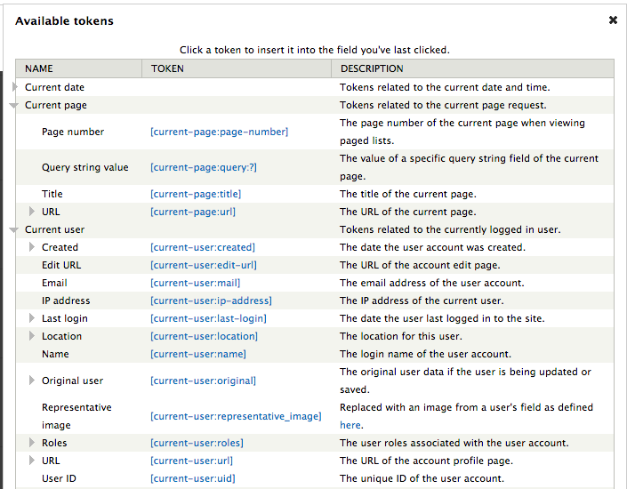
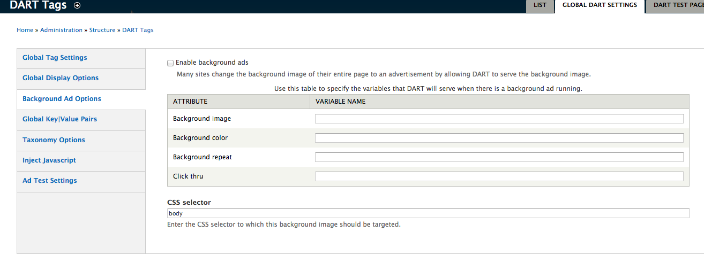
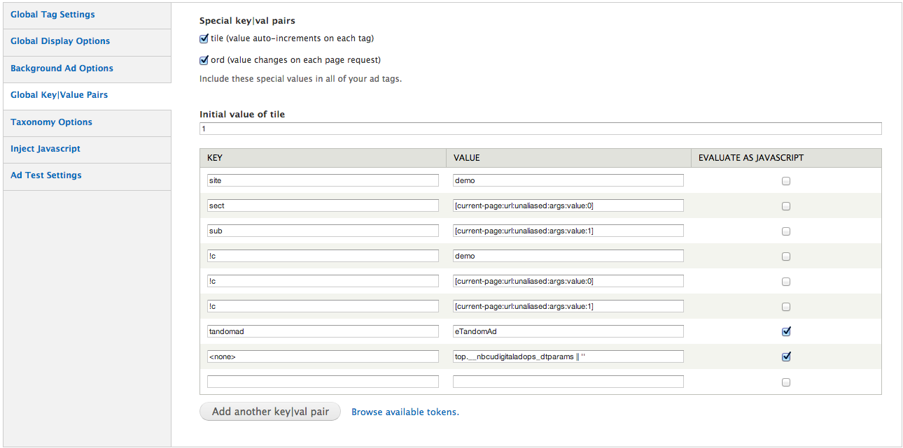
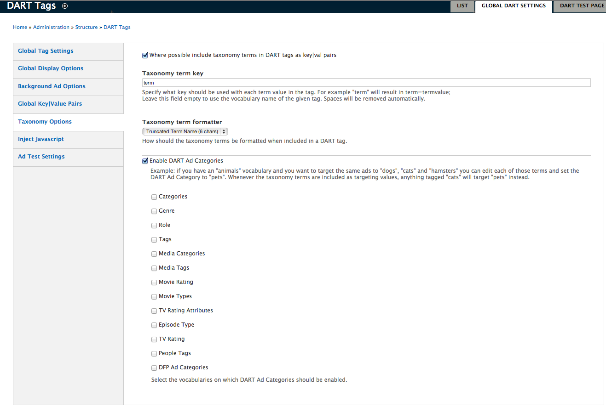
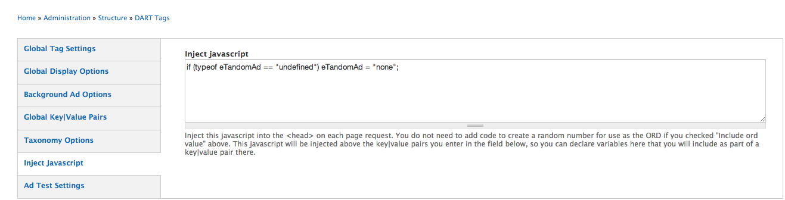

DART Module Ad Tagging (Legacy)
============================

Enter Global DART Settings
---------------

These Global Settings apply to all ad tags in your site.  You can override these settings for individual ad tags.  

To enter Global DART Settings: 

1. From the **Structure** menu, select **DART**, **Global DART Tags**.  

  The **Global Tag Settings** overlay appears with three tabs: 

  - **Global DART Settings**

  - **Ad Test Settings**

  - **List**

###Enter Global Tag Settings 

To enter Global Tag Settings: 

1. In the **Prefix** field, enter prefix text for your site provided by Ad Ops, such as **NBCU**.  

2. In the **Site** field, enter a category of information for your site such as **sports**.  

3. In the **Zone** field, enter a sub-category of information for your site, such as **baseball**.  

<a name="IncludeTokens">Include Tokens </a>
---------------

To include tokens: 

To add tokens: 

1. Place your cursor in the field to which you want to add tokens.  

2. Click the **Browse Available Tokens** link.  

  A list of available token types appears.  

3.  Click the arrow next to the required token type.  

  A list of token hyperlinks appears. 



4. Click on the required token hyperlink.  

  The token appears in the field in which you last placed your cursor. 

To complete the Global Tag Settings configuration:

1. Check the **Load Ads Last** box to have the rest of the items on the page download before the ads.  

  _**Note: This requires a JavaScript library.**_  

2.  Check the **Use Network ID** box. 

  The **Network ID** field appears.  

  _**Note: The new DFPP back-end system accepts DART tags only if you provide a Network ID, provided by Google.  This can be useful if a brand has moved its content to the new back-end system but the brand’s new tags are not ready for the transition.**_   

3.  Enter the **Network ID** provided by Google.   

###Enter Global Display Options

To enter Global Display Options: 

1. On the left pane, click **Global Display Options**.  

2. In the **Global Slug** field, enter the text required to appear above your ads, such as **Advertisement**.  

  _**Note: To leave the slug blank, enter <none>.**_

To specify that no animated advertisements appear on your site:  

1.  Click the **display** checkbox to specify **<no script>**, only if a user has JavaScript turned off or for ads that appear in emails. 

###Enter Background Ad Options

To enter Background Ad Options: 

1. On the left pane, click **Background Ad Options**.  

  The **Background Ad Options** screen appears.  



 
2. Check the **Enable Background Ads** box.  

  This specifies that ads should appear on the entire backgrounds of all pages of the site.

3. In the **Variable Names** field, enter **Variable Names** provided by Ad Ops for the following: 

  - **Background image**

  - **Background color**

  - **Background repeat** 

  - **Click thru**

4. In the **CSS Selector** field, enter the page division in which the background ad should be inserted, such as **body**. 

###Enter Key | Value Pairs

**Key | Value Pairs** provide the context in which ads appear on your page.  

To enter Key | Value Pairs: 

1.  On the left pane, click **Global Key | Value Pairs**.

  The **Global Key | Value Pairs** screen appears.  

2.  In the **Key** field, enter a category such as **daypart** or **color**.  

3.  In the **Value** field, enter a member of that category, such as **primetime** or **green**.  

  You can enter whatever key and whatever value you want.   You can use [tokens](#IncludeTokens) as Values.  

  _**Note: The key | value pairs appear in the html code of your site as a <script type src= setting, separated by semicolons.  In DART, this script type source has a 256-character limit.**_ 

To use a Javascript variable as a value: 

1.  Click the **Evaluate As JavaScript** check box next to the **Value** field.   

2.  In the **Value** field, enter the name of the Javascript variable.  

  _**Note: This variable is defined on the Inject Javascript screen.**_  

To add Values without Keys: 

1.  In the **Key** field, enter **<none>**. 

2.  In the **Value** field, enter the value.  



To provide values in automatically generated increments for each tag: 

1.  Check the **tile** box. 

  This specifies numerals for each ad in the order in which it appears in your html code, regardless of where the ad appears on the page.  

  The initial value of the **tile** field appears.  

2.  Enter a numeral with which you want the ad numbering to begin.  

To insert a random 10-digit numeral at the end of tags in DART: 

1.  Check the **ord** box.  

  The same 10-digit numeral appears after each DART tag for an individual page visit and changes with the next page visit.  

###Enter Taxonomy Options

Taxonomies are vocabularies you can use to categorize content.  One piece of content can have multiple Taxonomy Terms and those Taxonomy Terms can have multiple values.  For example, for a video, a Taxonomy Term **genre** can have values of both **sci fi** and **horror**.  




To enter Taxonomy Options: 

1.	On the left pane, click **Taxonomy Options**.

  The **Taxonomy Options** screen appears.  

2.	In the **Taxonomy term key** field, enter the key that should be used for each term value in the tag.  For example, **genre** or **funny**.  

  _**Note: You can enter term and use that as the Taxonomy Term for all of your values. In the html code for your page, the values appear as term=drama, term=reality, or term=comical.**_  

3. From the **Taxonomy term formatter** dropdown, select **Truncated Term Name (6 chars)**.

  This truncates the term so that it is easier to meet the DART 256-character limit for your script type source.

###DART Ad Categories 

At times, there might be editorial requests that do not correspond to the categories of ads being sold.  For example, an editor may want to tag content with the color *red*, when a category called *warm colors* is actually for sale.  

To redirect these requests to available ad categories: 

1.  Check the **Enable DART Ad categories** box.  

2.  Check the boxes for the categories you want to use.  

  A new ad category vocabulary is created.  You can edit terms in the vocabularies you select here to be tagged with terms from the ad category vocabulary.  

###Inject JavaScript  

To Inject Javascript: 

1.  On the left pane, click **Inject JavaScript**.  

  The **Inject JavaScript** screen appears.  

2. In the **Inject JavaScript** field, enter any JavaScript that the page needs to work. 

3. Click the **Save configuration** button. 



 
###Enter Ad Test Settings

To enter Ad Test Settings: 

1.  On the left pane, click **Ad Test Settings**.  

  The **Ad Test Settings** screen appears.  

  When you enter the **?adtest=true** query string to any url of your site, the new prefix, site, and zone you specify on this page replaces the prefix, site, and zone of your URL to create a test page on which clients can view their ads.  

2.  In the **prefix**, **site**, and **zone** fields, enter the values that DART tags should use for prefix, site, and zone when you add the **?adtest=true** query string. 

DART Test page 
---------------

To complete the DART Test Page: 

1.  Click the **DART Test Page** tab. 

2.  Enter the Site and Zone you want to use for a DART test site containing all of  a campaigns’ ads on a single page.  

List Tab
---------------

To complete the List tab: 

1.  Click **List**.  

  The List tab enables you to enter settings for individual ad tags.  It appears with the following sections: 

  - **Global Dislay Options**

  - **Display Options**

  - **Key | Value Pairs** 

2.  Click the **Add** link.   

  The **Tag Settings** screen appears.  

3. In the **Name** field, enter a human-readable name for this ad tag, such as **Top Banner**.  

4. In the **Position (pos)** field, enter a number for the page position of the ad.  

  _**Note: For NBC, Ad Ops provides a number for each position on the page.  Other organizations might use a Position such as banner_1.**_ 

5.  In the **Size (Sz)** field, enter the dimensions such as **300x250** or **300x600**.   

6. Click **Save**.  

###Global DART Setting Overrides

The Global DART Setting Overrides screen enables you to enter settings that override for individual ads the Global DART Settings configured for the site.  The Global Settings are provided on the screen.  

To enter Global DART Setting Overrides: 

1.  On the left pane, click **Global DART Setting Overrides**.  

2.  Enter the **Site**, **Zone**, and **Slug** required for this ad tag.  

###Display Options 

To complete Display Options: 

1.  On the left pane, click **Display Options**. 

  The **Display Options** screen appears.  

2.  Click the radio button for one of the required output types:

  - ```<script>```

  - ```<iframe>```

3.  Check the **Create a block for this a tag** box.  

  This creates a Drupal block that makes it easy to place an ad tag in the correct place.  The block appears on your list of Blocks page (**Structure=>Block**.)

  _**Note: NBC always checks this but other organizations do not.  It is not checked by default.**_  

4. Check the **Render this tag without JavaScript** box if the ad is to appear in email only.

###Key | Value Pairs

To enter Key | Value Pairs: 

1.  On the left pane, click **Global Key | Value Pairs**.

2.  Enter one value in the **Key** field.  

3.  Enter one value in the **Value** field. 

4.  Click the **Save** button.  